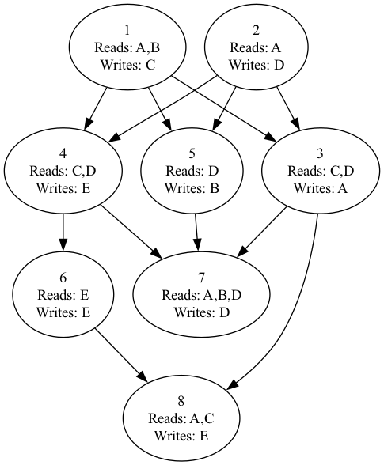

# Max Auto Parallelisation Library

An intelligent Python library for automatic task parallelization with dependency management and performance optimization.



## 🚀 Overview

Max Auto Parallelisation Library automatically optimizes task execution by:

- ✅ **Detecting and removing** redundant dependencies
- ✅ **Maximizing** parallel execution opportunities
- ✅ **Ensuring** thread-safe execution
- ✅ **Providing** real-time performance metrics

---

## 📦 Installation

Install from PyPI:

```bash
pip install max_auto_parallelisation_library
or manually install dependencies with:
pip install -r requirements.txt


## 📦 Insta
